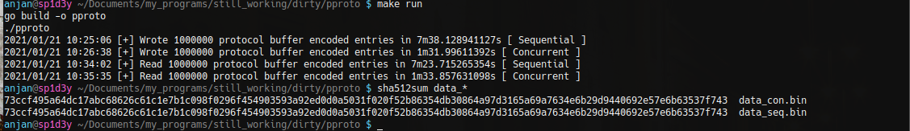

> **Warning**

**I've stopped maintaining this project !**

# pproto 🚀

Performant Protocol Buffer based data snapshotting mechanism ⚡️

## Problem Statement 🤨

We had a few database tables, each with >=10M entries and required to take snapshot of whole database into a file so that whole DB can be restored later from that single file.

## Solution ⚒️

I'm creating this POC to determine which way I should go for solving aforementioned problem.


1. I thought of starting with generating dummy random data and serializing them into JSON, which are eventually getting persisted into sink file, sequentially. But as you have already guessed, problems we'll face

    - Extremely large snapshot size
    - Very time consuming operation
    - Too much memory consumption
    
Due to all these, this approach is probably going to fail when solving actual problem. Only good thing, JSON snapshot is human readable. 🙂

2. So, I decided to serialize data into binary format using Protocol Buffer. But immediate problem I faced how to process such a large data set with out putting all of them into memory at a time i.e. I need to use stream processing.

Another issue, protocol buffers don't have any mechanism to denote ending of self in a byte array. So I decided to first put size of protocol buffer serialized byte array inside _4 bytes space_ and then actual proto serialized data. That'll be helpful while reading data back from file. 🤯

```go
func protoSerialize(fd io.Writer, data []byte) {

    // Store size of message ( in bytes ), in a byte array first
    // then that's to be written on file handle
    buf := make([]byte, 4)
    binary.LittleEndian.PutUint32(buf, uint32(len(data)))

    // first write size of proto message in 4 byte space
    if _, err := fd.Write(buf); err != nil {

	    log.Printf("[!] Error : %s\n", err.Error())
	    return

    }

    // then write actual message
    if _, err := fd.Write(data); err != nil {

	    log.Printf("[!] Error : %s\n", err.Error())
	    return

    }

}
```

Now we've a mechanism to effieciently encode and decode large dataset using protocol buffer.

I've written a function to sequentially serialize randomly generated protocol buffer data and put them in a file while first putting length of data and then actual data.

But as you've already guessed, this time problem was very slow processing. I attempted to introduce concurrency in this process
    
- Created worker pool of size = _#-of CPUs in machine_
- Each worker generated randomly created protocol buffer struct & serialized message into byte array
- Workers sent that byte array to writer go routine, via go channel
- Writer go routine attempts to write to file as soon as it receives data over channel

And as a result of this I just got ~680% 🚀 performance improvement, in running time of program.


I generated 1M similar entries, serialized them into protocol buffer _( with a synthetic delay of 1μs )_ and wrote them into target files `data_seq.bin` & `data_con.bin`, for sequential & concurrent processing respectively.

After checking their sha256 hash, I was sure both serial & concurrent versions were working correctly.

3. Now I need to deserialize data from file, for that I'm simply using plain old sequential way,

- I read 4 bytes of chunk from file.
- Then decode it to `uint32`, which gives me what's next chunk size, to be read.
- I read next data chunk of 👆 size, which is protocol buffer encoded data of our interest.
- Deserialize it into structured format.

I keep following above flow until **EOF** is hit.

👆 works fine, but when snapshot size grows larger, it takes longer to recover from snapshot.

4. For addressing that, I'm going to introduce concurrency while processing data chunks read from file.

**Why can't we concurrently read from file ?**

We may not know what exactly is data chunk size, in which a single protocol buffer encoded struct is placed. All we know is

```
<size-of-next-chunk> + <proto-serialized-data>
```

from start of file to end. `size-of-next-chunk` is encoded in 4 bytes space. 

So, I read byte chunks from file in sequential fashion. But each of those byte chunks get processed i.e. deserialized with a synthetic delay of 1μs to emulate I/O ops, by multiple workers, taken from worker pool. And go channel based synchronization is used to manage them i.e. let all of them complete their job.

And I've got 👇 result for reading & writing of 1M entries with synthetic delay of 1μs on a desktop machine with i3 Gen V with 12GB RAM + HDD



Using concurrent processing of snapshot we get ~471% 🚀 performance improvement over its sequential counterpart.

## Usage

For running this simulated version

```bash
make run
```

Two files will be created in this directory

```bash
$ ls data_*
data_con.bin	data_seq.bin
```

As they're writing same content to both files, just in different way i.e. sequentially & concurrently, checksum of their content will be same

```bash
$ shasum data_*
e2b12866fc038c55b7ab274421550c5329e777f3  data_con.bin
e2b12866fc038c55b7ab274421550c5329e777f3  data_seq.bin
```

> Note : If you make any changes in protocol definition files 👇

```bash
make clean # deletes previous binding
make gen # generates new go lang binding
```
