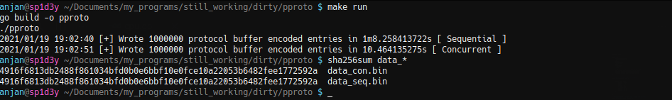

# pproto 🚀

Performant Protocol Buffer based data snapshotting mechanism ⚡️

## Problem Statement 🤨

I had a few database tables, each with >=10M entries and required to take snapshot of whole database into a file so that whole DB can be restored later from that single file.

## Solution ⚒️

I'm creating this POC to determine which way I should go for solving aforementioned problem.


1. I thought of starting with generating dummy random data and serializing them into JSON, which are eventually getting persisted into sink file, sequentially. But as you have already guessed, problems I'll face

    - Extremely large snapshot size
    - Very time consuming operation
    - Too much memory consumption
    
Due to all these, this approach is probably going to fail when solving actual problem. Only good thing, JSON snapshot is human readable. 🙂

2. So, I decided to serialize data into binary format using Protocol Buffer. But immediate problem I faced how to process such a large data set with out putting all of them into memory at a time i.e. I need to use stream processing.

Another issue, protocol buffers don't have any mechanism to denote ending of self in a byte array. So I decided to first put size of protocol buffer serialized byte array inside _4 bytes space_ and then actual proto serialized data. That'll be helpful while reading data back from file. 🤯

```go
func protoSerialize(fd io.Writer, data []byte) {

    // Store size of message ( in bytes ), in a byte array first
    // then that's to be written on file handle
    buf := make([]byte, 4)
    binary.LittleEndian.PutUint32(buf, uint32(len(data)))

    // first write size of proto message in 4 byte space
    if _, err := fd.Write(buf); err != nil {

	    log.Printf("[!] Error : %s\n", err.Error())
	    return

    }

    // then write actual message
    if _, err := fd.Write(data); err != nil {

	    log.Printf("[!] Error : %s\n", err.Error())
	    return

    }

}
```

Now I've a mechanism to effieciently encode and decode large dataset using protocol buffer.

I've written a function to sequentially serialize randomly generated protocol buffer data and put them in a file while first putting length of data and then actual data.

But as you've already guessed, this time problem was very slow processing. I attempted to introduce concurrency in this process
    
- Created worker pool of size = _#-of CPUs in machine_
- Each worker generated randomly created protocol buffer struct & serialized message into byte array
- Workers sent that byte array to writer go routine, via go channel
- Writer go routine attempts to write to file as soon as it receives data over channel

And as a result of this I just got 680% 🚀 performance improvement, in running time of program.



I generated 1M similar entries, serialized them into protocol buffer _( with a synthetic delay of 1us )_ and wrote them into target files `data_seq.bin` & `data_con.bin`, for sequential & concurrent processing respectively.

After checking their sha256 hash, I was sure both serial & concurrent versions were working correctly.

3. Next step is to write an efficient deserializer.

**To be continued ...**
